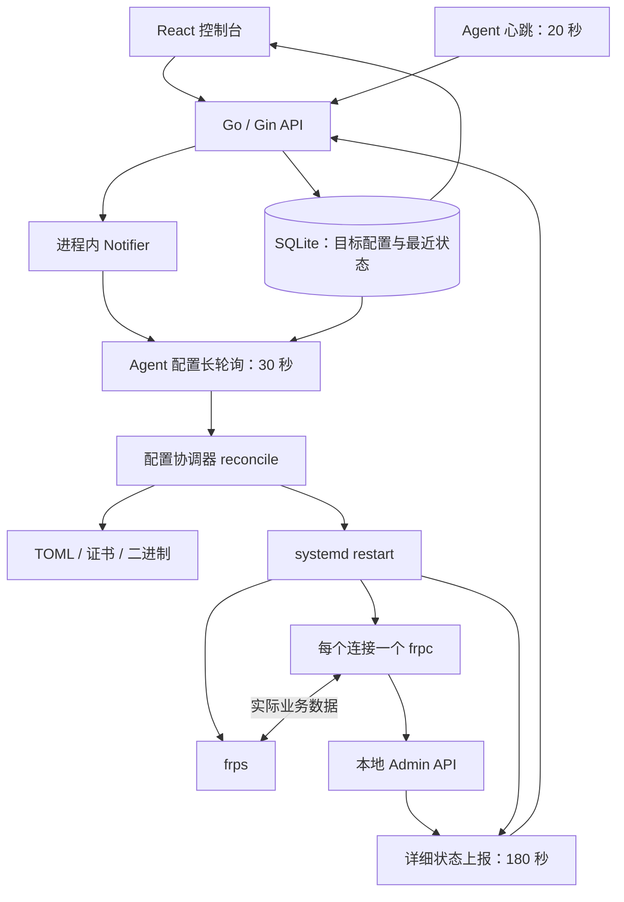

# FRP 架构与稳定性审查

日期：2026-09-15。范围：当前工作区实现、安装模板、前端状态展示、现有测试及四个隔离复现。

## 结论

建议保留 Go 控制面、独立 Agent、systemd、frps/frpc 数据转发这一主体，优先修复确定缺陷，并重构状态模型和配置协调器。现有证据不足以认定 frp 引擎不稳定，也不足以支持全量重写。当前确实同时存在“监控误报”和“管控操作导致真实故障”的问题。

本次没有修改运行代码，也没有操作实际 frp 服务或生产数据库。未取得测试现场日志、实际部署版本、网络抓包和业务探测数据，因此下述“代码可复现”不等同于已确认某一次现场故障的唯一根因。

## 1. 现有工作原理



- 一个 FRPC 宿主机对应一个 Agent；每个 connection 对应独立 frpc 进程、配置目录、证书和 Admin 端口。
- Agent 启动 heartbeat、status、configSync、watchdog 四个并行循环。
- 配置变更通过连接版本与宿主机汇总版本传播，Notifier 唤醒长轮询。连接成功应用后记录本地版本，全部成功才推进宿主机版本。
- 配置写入采用 `.new`、备份、逐文件 rename，然后重启；“应用成功”的检测仅为 systemd active。
- UI 大多数详情页每 10 秒拉取，拓扑每 15 秒拉取，读取的是控制面保存的状态。
- 业务流量经过 frpc/frps，不经过控制面。控制面失联与业务隧道失联应当能够独立表达。

这个分层本身可以保留；部分失败不推进汇总版本、长轮询版本兜底、独立进程隔离也是合理基础。

## 2. 已确认的关键缺陷

### P0：删除一个连接会删除所有实例的目录

位置：`internal/agent/connections.go:101-109`，路径定义见 `internal/frp/paths.go`。

```text
ConfigDir = /opt/service-edge/frpc-agent/instances/A/config
Dir(Dir(ConfigDir)) = /opt/service-edge/frpc-agent/instances
```

`stopConnection` 将后一条路径传给 `os.RemoveAll`，不是只删除 A。其他实例的 TOML、证书和日志也会被删除。已经运行的进程可能暂时继续转发，但下次重启会缺少文件；本地 State 仍把其他连接记为已应用，同版本协调又会跳过它们，形成持续故障。

Stop/Disable 错误被忽略，而且后续无条件移除本地连接状态。即使停止失败，也可能忘记仍在运行的实例。

**验证：** 隔离执行路径计算，确认 sibling B 位于删除目标内；没有执行真实删除。

**建议：** 专门的 InstanceDir 路径函数、目录边界约束、删除结果确认；停止失败保留待删除状态重试。补充“删除 A 保留 B”测试。

### P1：180 秒上报与 60 秒过期直接冲突

位置：`internal/agent/config.go:48`、安装模板、`internal/service/agent.go:281`、`:326`、`cmd/server/main.go:104`。

- 连接状态和连接 last_heartbeat 仅由详细状态上报更新，默认间隔 180 秒。
- 宿主机 20 秒心跳只刷新 FRPCHost。
- ReapStaleAgents 每 20 秒扫描，连接超过 60 秒即判离线。

稳定运行时也会出现：详细上报后在线，约 60～80 秒后离线，180 秒下一次上报后又在线；UI 轮询再叠加 0～10/15 秒。配置应用后另有延迟上报，会改变相位，但不消除矛盾。

**验证：** SQLite 隔离测试中连接 last_heartbeat 为 80 秒前，宿主机刚刚心跳，扫描后宿主机 online、连接 offline。

**建议：** 连接轻量状态高频采集；Agent 心跳租约和连接观测有效期分开。临时扩大连接 TTL 可以止住误报，但不能解决检测迟缓，也不能用宿主机在线直接推导连接在线。

### P1：进程存活、连接成功、代理可用混为一谈

位置：`internal/service/agent.go:281`、`internal/agent/frpstatus.go:16`、`web/src/pages/ConnectionDetail.tsx`。

- Connection 的 online 完全由 ProcessAlive 决定。
- Admin API 网络错误、401、非 200、JSON 错误都变成 nil，没有可传输的错误状态。
- 代理 running 等状态没有作为运行事实保存；只处理 start error/check failed。
- UI 的“已激活”仅表示 inactive=false，即“配置被允许下发”，不证明业务可访问。
- FRPS 的 ActiveConnections 和 LastError 有协议与数据库字段，但 reportStatus 没有采集并填充它们，零值会写入数据库。

**建议：** 分离 Agent 可达、进程存活、frp 会话、proxy 注册、后端健康、端到端探测；采集失败显示 unknown/stale 并保留原因、时间。没有流量应显示空闲，不能推导断线。

### P1：监控结果反向修改目标配置，可能放大瞬时故障

位置：`internal/service/agent.go:297`、`internal/service/proxy.go:183`、`internal/service/config_renderer.go`。

`start error`/`check failed` → 将映射 inactive=true → bumpConnection → 下发去掉映射的配置 → 重启 frpc。

随后 FRPS 端口扫描发现端口空闲 → ReevaluateOccupancy 重新激活 → 再 bump → 再重启。此恢复逻辑没有限定失败原因。TCP/UDP 可进入禁用、启用循环；HTTP/HTTPS 不属于该自动恢复分支。

**验证：** 直接注入短暂 check failed，确认目标映射被禁用；再提供端口空闲快照，确认恢复并再次增加版本。实际网络条件下循环频率尚未实测。

**建议：** 运行异常写入 observed 状态，保留用户 desired enabled；恢复采用有原因分类、退避和阈值的显式策略，不因一次采样删掉目标代理。

### P1：FRPS 旧状态可以覆盖新目标二进制版本

位置：`internal/service/agent.go:257-258`、`BuildConfigResponse`。

同一 frp_version 既作为用户期望版本，又被 Agent 上报覆盖。用户设置新版本后，旧进程的状态可能把字段改回旧版本，且不递增配置版本。后续 bundle 使用这个被覆盖的值。

**验证：** 目标 v0.68.0、配置版本 9，收到 v0.61.1 上报后，目标变为 v0.61.1，配置版本仍是 9。

**建议：** desired_binary_version 与 observed_binary_version 分字段保存。运行版本应识别实际进程，不能只执行磁盘上二进制的 --version。

### P1：FRPC 升级共享二进制却跳过已有连接重启

位置：`internal/service/host.go:81`、`internal/agent/connections.go:26-44`。

修改宿主机版本只推进 host.ConfigVersion；Agent 安装新的共享二进制之后，仍按连接 ConfigVersion 决定是否跳过。已有连接版本未变，就不重启。磁盘是新版，已有进程仍可运行旧版，却会确认整个 bundle 成功。

**依据：** 代码路径确认，尚未做实际多进程升级复现。

**建议：** 每个实例的应用身份包含配置 hash、二进制版本、证书版本；升级为明确的逐实例操作并记录实际进程版本。

### P1：配置确认不代表可用，也缺少持久的确认闭环

位置：`internal/frp/process.go:49`、`internal/agent/applier.go:104`、`internal/api/handler/agent.go:112`、`internal/agent/state.go:49`。

- WaitActive 一旦 active 立即返回，并不是持续稳定 5 秒；systemd Type=simple 不能证明 frp 登录或代理注册成功。
- ACK 只记审计日志，未保存 desired/applied/ready 的对应关系；心跳、状态中的 ConfigVersion 也未用于维护已应用版本。
- ACK 发送失败仅 debug 日志，没有持久重试；本地版本已推进，下一次通常不再投递同一 bundle。
- Save/SaveHost 先改变内存版本再写盘；失败后上层仍确认成功。部分成功的连接状态只在整个 bundle 成功时落盘。
- 配置、证书是逐文件 rename，不是整组事务。备份失败被吞掉；二进制安装在 Apply 前完成，配置回滚不会回滚二进制。

**建议：** 明确 received/staged/applied/ready/failed；applied 表示采用配置，ready 表示所需功能可用，两者独立。维护持久 ACK/操作记录，定期携带 applied 信息补偿 ACK 丢失。以不可变版本目录、切换指针和崩溃恢复记录管理配置、证书与二进制。

## 3. 其他稳定性与扩展性问题

| 问题 | 代码依据与影响 | 处理方向 |
| --- | --- | --- |
| 慢实例拖垮整批上报 | connections.go:114：串行查询所有 Admin，每个最多 5 秒，全批采集和最终 POST 共用 15 秒 context；约三个超时实例即可耗尽预算 | 有界并发、单实例超时、独立上传预算；部分结果也必须可提交 |
| 外部命令无超时 | systemd.go、process.go 使用 exec.Command；HTTP context 不能中止卡住的 systemctl | exec.CommandContext、超时原因、可取消关停 |
| 重启责任重叠 | systemd Restart=on-failure；watchdog 每 30 秒重启；Apply 也重启；watchdog 3 次/5 分钟预算在全宿主机共享 | systemd 负责进程退出恢复，协调器负责期望配置；按实例锁和预算避免删除/应用与重启竞争 |
| 普通变更也重启 | ReloadOrRestart 无条件 restart；改连接名称也 bump；改 FRPS 名称也 bump 所有客户端 | 元数据变更不部署；配置内容 hash；代理变更用受支持的 Admin reload，公共/TLS/二进制变更受控重启 |
| 长轮询丢唤醒窗口 | handler/agent.go：先 deliver 检查，再 Subscribe；中间发布无人接收 | 先订阅再检查，超时再检查；版本依然是事实，通知只是加速 |
| 版本传播非事务 | AddProxy 等写入提交后再 bumpConnection/bumpHost，多个数据库错误被忽略 | 配置与相关版本同事务提交，通知在提交后发送 |
| 缺少周期性实际状态校准 | 只要本地版本满足就跳过，不检查配置文件缺失、二进制/证书漂移；删除越界尤其会触发这种故障 | 周期比较 desired 与实际资源，修复缺失；用 epoch/hash 处理控制面恢复后版本倒退 |
| 旧报告覆盖新事实 | 定时与 apply 后 goroutine 可并发采集上报；没有 sample time、序号、session 标识或逐连接应用版本校验 | 每个 Agent 会话的单调序号及版本关联，拒收倒序报告 |
| 端口事实信息不足 | /proc 采样合并 TCP/UDP，只报 int 端口，无地址、PID/所有者；截断列表和读取失败无质量信息 | 协议+地址+端口+所有者；记录完整性与新鲜度，快照仅作提示 |
| FRPS 列表无周期刷新 | FRPSList.tsx 无 refetchInterval；main.tsx 全局关闭 focus 刷新 | 统一刷新策略或服务端事件，展示最后采样时间 |
| 超时配置未生效 | ConfigPollTimeout 被加载却没有用于 Poll 请求 | 明确服务端/反向代理/Agent 超时契约，验证启动参数 |
| 单机控制面扩展边界 | SQLite 单连接；Topology 逐宿主机、连接读代理；Notifier 仅当前进程有效 | 先度量队列等待、SQL/HTTP 延迟和 N+1，再决定批量查询、数据库/跨实例通知迁移 |

长轮询检查/订阅竞态通常带来约 30 秒额外等待，下一轮版本检查可补偿，不能将它描述为必然永久丢配置。数据库更新和版本推进的非原子性则可能在崩溃或数据库错误后留下无法自动发现的漂移。

## 4. 延迟与活动观测应该如何定义

当前核心采集和协议没有 RTT、业务响应时间、丢包/失败率、流量速率的完整链路。状态刷新慢并不能证明业务数据传输慢。

建议分别测量：

1. Agent → 控制面：心跳请求耗时、上报延迟、失败率。这是管理链路。
2. frpc → frps：当前传输协议下的连接建立耗时、重连次数；额外 TCP 拨号仅代表 TCP 可达性，不能冒充 QUIC/KCP RTT。
3. Agent → 本地业务：TCP 建连或 HTTP 健康请求耗时，检测本地服务失败。
4. 外部探针 → frps 公网入口 → frpc → 本地业务：端到端响应耗时与成功率。
5. 活动：连接数、请求/流量计数与速率；计数重置应关联进程启动标识。

frps 支持 Prometheus，通过 Dashboard 地址提供 /metrics；官方提示 Dashboard 内部查询 API 尚未标准化。优先使用受支持的指标，直接依赖内部 API 时固定版本并做契约测试。[官方监控文档](https://gofrp.org/en/docs/features/common/monitor/)

frpc 支持开启 webServer 后通过 reload 动态更新代理；公共连接参数不属于这一更新范围。不能把当前代码注释“重启是唯一可靠方式”推广成 frp 的能力限制。[官方客户端文档](https://gofrp.org/en/docs/features/common/client/)

## 5. 建议的目标架构

继续使用独立 frp 二进制，把 Agent 调整为三个职责明确的组件：

- **协调器**：读取完整 desired bundle，按实例串行比较实际状态；应用、升级、删除都有明确阶段和幂等重试。
- **采集器**：systemd、Admin API、frps 指标、本地/端到端探测；输出事实及采样质量，不直接更改用户配置。
- **上报器**：合并事件、限流、有界缓冲、定期完整快照；单独管理网络超时和重试。

建议运行模型：

```text
desired: config_revision, content_hash, binary_version, enabled
observed: agent_session, sequence, sampled_at, received_at,
          applied_revision, running_binary_version,
          process_state, session_state, proxy_state,
          backend_health, end_to_end_health, last_error
```

每个状态携带自己的有效期；过期显示 unknown/stale，最后已知值保留作参考。Agent 失联不自动断言数据面已断；代理已注册也不自动断言本地业务健康。

控制面保留用户意图和运行事实的分离存储；UI 显示“期望版本 / 已应用版本 / 就绪情况 / 最近采样时间”。事件推送可以减少 UI 等待，但即使继续 HTTP 轮询，也可以先修好正确性。

### 迁移顺序与验收

| 阶段 | 工作 | 验收 |
| --- | --- | --- |
| 0：修复确定缺陷 | 删除范围、连接 TTL、desired/observed 版本、FRPC 升级、采集与上传预算、数据库错误传播 | 删除 A 保留 B；健康连接不周期离线；旧报告不改变目标版本；每个进程实际升级 |
| 1：重构状态链路 | 分层状态、采样时间/序号、错误传播、轻量高频采样、指标与探针、统一前端刷新 | Admin API 失败显示 unknown；控制面断网与业务断网可区分；报告倒序不回退状态 |
| 2：重构协调器 | 持久应用状态、按实例串行操作、hash/epoch 校准、热更新分类、完整回滚 | ACK 丢失自动补偿；应用中崩溃后恢复；证书/二进制失败回到可运行版本；变更不误重启其他连接 |
| 3：实测与容量优化 | 真实 frps/frpc 故障注入、网络扰动、端到端长连接、规模压测 | 按不同故障给出发现耗时、恢复耗时、业务中断耗时的 p50/p95/p99 |

可先以轻量状态采样 5～10 秒、Agent 租约 30～60 秒、主机静态信息 60～180 秒作为待验证参数。它们不是当前实现保证的指标；大规模时需要分批、抖动和容量预算。UI 发现延迟应按“采样周期 + 上传/处理 + 刷新周期”制定目标，不能只降低前端轮询间隔。

全量重写仅在明确要求多地域控制面、高可用和大规模容量，且增量方案经压测无法满足时再评估；当前先修管控逻辑更容易验证收益。

## 6. 验证结果与尚待实测事项

- `go test ./...` 通过。
- `go vet ./...` 通过。
- 现有 Agent、frp、API handler 包显示无测试文件；现有测试不能证明核心协调与故障处理正确。
- 使用 Go overlay 临时注入四个审查测试，没有修改项目运行代码：连接过期、故障禁用/恢复、旧版本覆盖、删除路径计算均复现。
- 临时复现文件位于 `/tmp/service-edge-audit-u4vls2_m/`，可在本次工作环境用以下命令再次运行。测试断言的是“缺陷确实发生”，通过不代表系统健康；正式修复应改为正确行为的回归断言。

```bash
go test -overlay /tmp/service-edge-audit-u4vls2_m/overlay.json ./internal/service ./internal/agent -run TestAudit -v
```

下一轮现场验证应覆盖：正常无配置变更持续运行；停止本地业务；停止/恢复 frps；仅隔离控制面；Admin API 黑洞；多个连接中删除一个；升级共享二进制；证书更新失败；ACK 丢失；磁盘写入失败；Agent 在部分应用后重启；快速连续修改配置。

每次记录同一 connection UUID 对应的 desired/applied revision、进程 PID/版本、采样时间、控制面接收时间和外部请求结果，才能把“显示异常”“管理链路异常”“实际业务异常”逐一归因。
